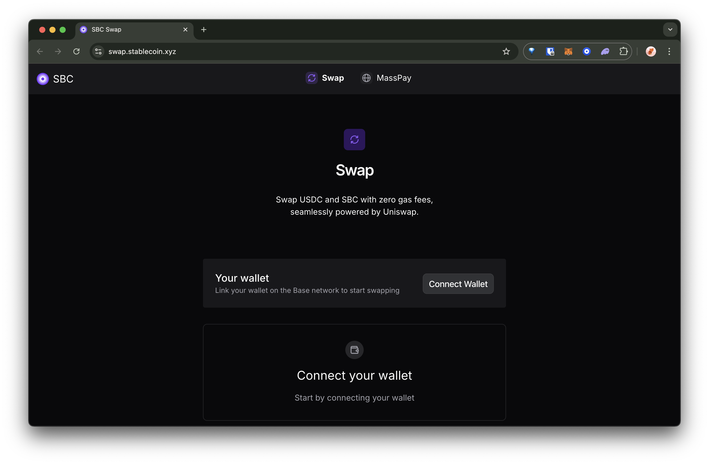

# swap

This project is a simple web application that allows users to swap tokens on the Base blockchain without having to pay for gas fees. It uses an open-sourced Paymaster from [SBC](https://stablecoin.xyz) and common libraries like [`viem`](https://viem.sh/) to execute the swaps via the [Uniswap V3 Router](https://docs.uniswap.org/contracts/v3/reference/periphery/SwapRouter) and [WalletConnect](https://reown.com/) to connect to the user's wallet.

## Usage

You can see it live [here](https://swap.stablecoin.xyz/). You need to be on the Base blockchain.

[](https://swap.stablecoin.xyz/)

After connecting your wallet, you can swap between [USDC](https://basescan.org/token/0x833589fcd6edb6e08f4c7c32d4f71b54bda02913#code) and [SBC](https://basescan.org/token/0xfdcC3dd6671eaB0709A4C0f3F53De9a333d80798#code) tokens in either direction.

You don't need any ETH to pay for gas fees as our Paymaster will cover the fees for you.

## Environment Variables

To run this project locally, you'll need to set up the following environment variables in your `.env` file:

### Required API Keys

```bash
# Get a project ID from https://cloud.reown.com/ (WalletConnect)
NEXT_PUBLIC_WALLETCONNECT_PROJECT_ID=""

# Get an Alchemy RPC endpoint for the Base network from https://alchemy.com/
NEXT_PUBLIC_ALCHEMY_BASE_ENDPOINT=""
```

### Account Abstraction Setup

```bash
# 1. Get an API Key for the SBC paymaster from the SBC Dashboard - https://dashboard.stablecoin.xyz/
# 2. Replace YOUR_SBC_API_KEY with your API Key from the SBC Dashboard
NEXT_PUBLIC_AA_BASE_URL="https://aa-proxy.up.railway.app/rpc/v1/base/YOUR_SBC_API_KEY"
```

### EIP-7702 Setup (Optional)

```bash
# 1. Get your ZeroDev App ID from https://dashboard.zerodev.app/projects (Make sure Base is enabled)
# 2. Replace YOUR_ZERODEV_APP_ID with your ZeroDev app ID
NEXT_PUBLIC_ZERODEV_APP_ID="YOUR_ZERODEV_APP_ID"
```

## Run locally

Install dependencies

```bash
npm install
```

Start development server

```bash
npm run dev
```

## Author

- [@Ectsang](https://www.github.com/Ectsang)
